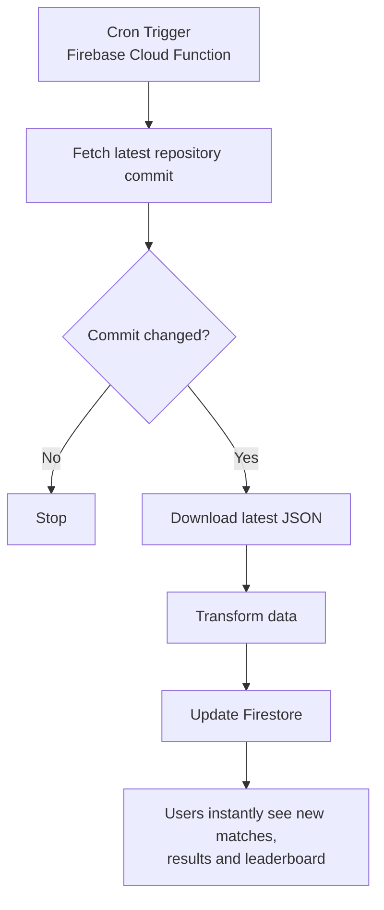

A prediction pool web application built for the FIFA World Cup.

Users can submit match predictions, compete on a live leaderboard, and automatically receive points as official results become available through scheduled Firebase synchronization.

# How this project started
This project started during a Discord call with a group of friends.

A few days before the FIFA World Cup kicked off, we were talking about Mexico's opening match and, as usually happens, everyone started predicting possible scores. At some point, someone suggested that it would be fun to keep track of everyone's predictions and see who ended up with the best results throughout the tournament.

My first thought was to put together a simple Excel spreadsheet. It would have worked, but after thinking about it for a few minutes I realized it could be something much more interesting.

So I decided to build it.

What began as a small tool for my friends and me became an opportunity to design and build a complete web application from scratch. It allowed me to put my skills into practice, experiment with modern technologies, and create something that people would actually use during the World Cup.

Although this is a personal project, I approached it with the same mindset I would apply to any production application: building something maintainable, enjoyable to use, and worth sharing as part of my portfolio.

# ✨ Features

## 🔐 Authentication

Since this application was built exclusively for my group of friends, I didn't need a public sign-up process. Instead, user access is managed through Firebase Authentication, where I manually created the accounts for each participant.

This approach kept the application simple while ensuring that only invited users could access the prediction pool.

## ⚽ Match Predictions

Predictions can be submitted for every match of the tournament, from the group stage all the way to the final.

The interface is organized by tournament stages, making it easy to navigate as the competition progresses. Each stage became available as the World Cup advanced, mirroring the real tournament schedule.

## 🎯 Automatic Scoring

Points are calculated automatically once the official match results are available.

The scoring system follows a predefined set of rules that we agreed on before the tournament started, eliminating manual calculations and keeping the leaderboard updated after every match.

The complete scoring rules are available in the [rules](https://pickem-worldcup-five.vercel.app/reglas) section of the application.

## 🏆 Live Leaderboard

A dynamic [leaderboard](https://pickem-worldcup-five.vercel.app/clasificacion) keeps track of every participant's score throughout the tournament.

Besides showing the current rankings, it also allows users to inspect each participant's predictions, making it easy to compare results and follow everyone's performance as the tournament unfolds.

# ⚙️ Automated data synchronization
Match schedules and results weren't managed manually.

Instead, I created a scheduled Firebase Cloud Function that periodically checked an upstream repository containing the latest tournament data.

The function compared the latest commit hash with the one stored in Firestore. Whenever a new commit was detected, it meant new information had been published. It then downloaded the updated dataset, transformed it into the format required by the application, and synchronized the changes with Firestore automatically.

This approach kept the application up to date throughout the tournament without requiring any manual intervention.

## 📊 By the numbers

- 👥 8 participants
- ⚽ 104 matches
- 🎯 832 predictions submitted
- 🔄 Automatic data synchronization throughout the tournament

## 💡 What I learned

Although this started as a fun project for my friends, it became an opportunity to solve problems that go beyond building a typical CRUD application.

During development I learned how to:

- Design a Firestore data model for tournament predictions.
- Build scheduled background jobs with Firebase Cloud Functions.
- Synchronize external datasets while avoiding unnecessary database writes.
- Transform third-party data into a structure optimized for the frontend.
- Design an application around a real-world event where data changes continuously.

# 🛠️ Tech Stack

  

### 🙏 Acknowledgements

This project wouldn't have been possible without these amazing open-source resources:

- **geraldb** – Maintainer of the [worldcup.json](https://github.com/openfootball/worldcup.json) repository, which provided the official tournament schedule and results.
- **upbound-web** – Maintainer of the [worldcup-live.json](https://github.com/upbound-web/worldcup-live.json) repository. Their "fast-upload" workflow made match updates available much sooner, allowing the application to synchronize results almost immediately after they became official.

A huge thank you to both projects for making their data publicly available.
